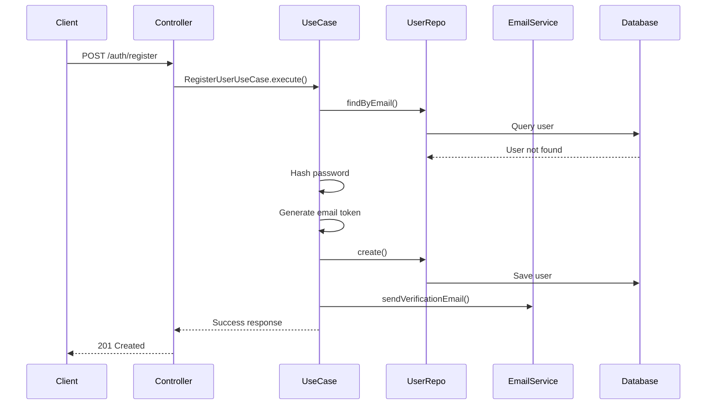
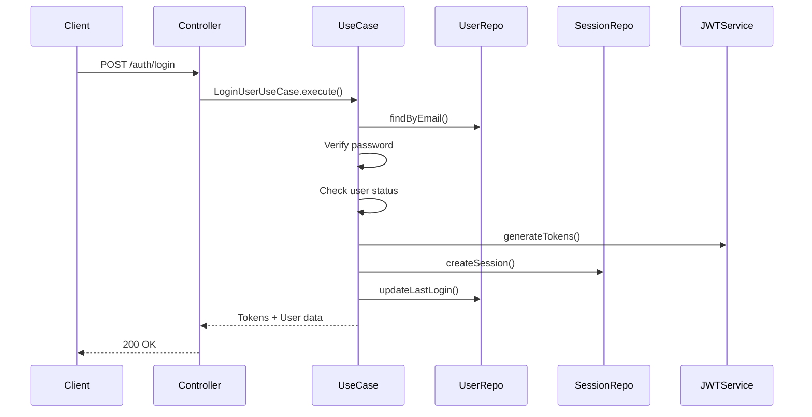
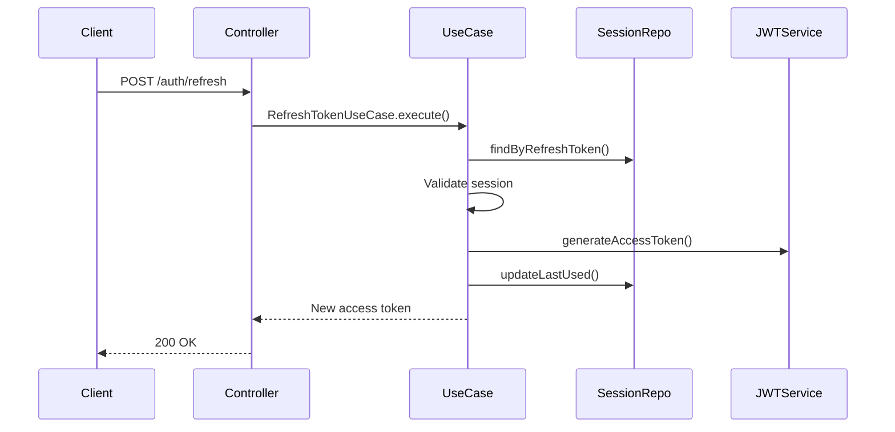
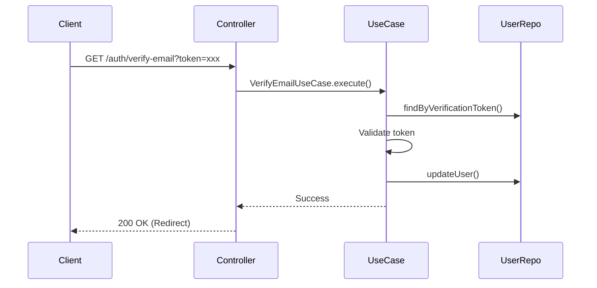
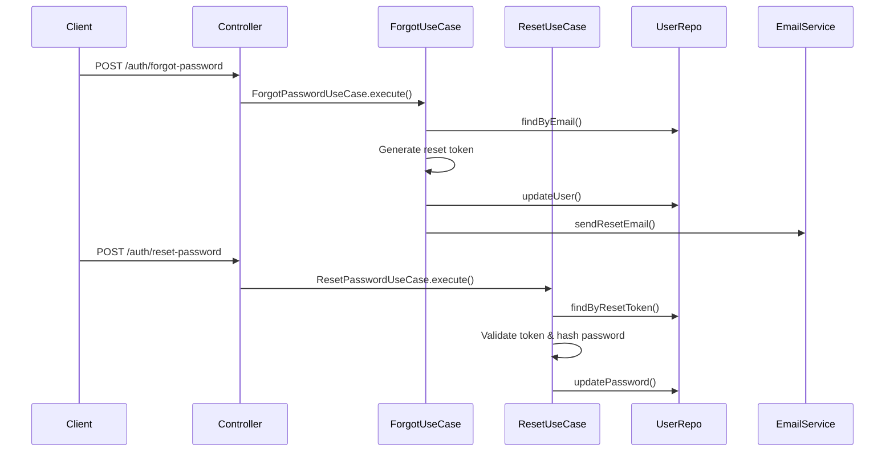

# Authentication Flow - Education Platform

## 🔐 **Authentication Architecture**

### **Clean Architecture Layers for Auth**

```
📁 src/modules/auth/
├── 🎯 Application Layer
│   ├── dto/
│   │   ├── register.dto.ts
│   │   ├── login.dto.ts
│   │   ├── refresh-token.dto.ts
│   │   └── reset-password.dto.ts
│   ├── use-cases/
│   │   ├── register-user.use-case.ts
│   │   ├── login-user.use-case.ts
│   │   ├── refresh-token.use-case.ts
│   │   ├── verify-email.use-case.ts
│   │   ├── forgot-password.use-case.ts
│   │   └── reset-password.use-case.ts
│   └── interfaces/
│       ├── auth-service.interface.ts
│       └── token-service.interface.ts
│
├── 🏛️ Domain Layer
│   ├── entities/ (already created)
│   ├── repositories/
│   │   ├── user.repository.interface.ts
│   │   └── session.repository.interface.ts
│   └── services/
│       ├── password.service.ts
│       └── email.service.interface.ts
│
├── 🔧 Infrastructure Layer
│   ├── repositories/
│   │   ├── user.repository.ts
│   │   └── session.repository.ts
│   ├── services/
│   │   ├── jwt.service.ts
│   │   ├── bcrypt.service.ts
│   │   └── email.service.ts
│   └── strategies/
│       ├── jwt.strategy.ts
│       └── local.strategy.ts
│
└── 🎮 Presentation Layer
    ├── controllers/
    │   └── auth.controller.ts
    ├── guards/
    │   ├── jwt-auth.guard.ts
    │   ├── roles.guard.ts
    │   └── email-verified.guard.ts
    └── decorators/
        ├── current-user.decorator.ts
        └── roles.decorator.ts
```

## 🔄 **Authentication Flows**

### **1. User Registration Flow**



**Steps:**

1. ✅ Validate input data (email, password, name, role)
2. ✅ Check if email already exists
3. ✅ Hash password with bcrypt
4. ✅ Generate email verification token
5. ✅ Save user with PENDING status
6. ✅ Send verification email
7. ✅ Return success message

### **2. User Login Flow**



**Steps:**

1. ✅ Validate email and password
2. ✅ Find user by email
3. ✅ Verify password hash
4. ✅ Check user status (active, email verified)
5. ✅ Generate JWT access token (15min)
6. ✅ Generate refresh token (7 days)
7. ✅ Save session in database
8. ✅ Update last login timestamp
9. ✅ Return tokens and user data

### **3. Token Refresh Flow**



**Steps:**

1. ✅ Validate refresh token
2. ✅ Find session in database
3. ✅ Check session validity (not expired, active)
4. ✅ Generate new access token
5. ✅ Update session last used timestamp
6. ✅ Return new access token

### **4. Email Verification Flow**



**Steps:**

1. ✅ Extract token from URL
2. ✅ Find user by verification token
3. ✅ Check token validity
4. ✅ Update user status to ACTIVE
5. ✅ Set emailVerified to true
6. ✅ Clear verification token
7. ✅ Redirect to login page

### **5. Password Reset Flow**



**Steps:**

1. **Forgot Password:**
   - ✅ Find user by email
   - ✅ Generate reset token (1 hour expiry)
   - ✅ Save token and expiry to database
   - ✅ Send reset email with token

2. **Reset Password:**
   - ✅ Validate reset token and expiry
   - ✅ Hash new password
   - ✅ Update user password
   - ✅ Clear reset token
   - ✅ Invalidate all sessions

## 🛡️ **Security Features**

### **JWT Token Structure**

```typescript
// Access Token (15 minutes)
{
  sub: "user_id",
  email: "user@example.com",
  role: "student",
  status: "active",
  emailVerified: true,
  iat: 1234567890,
  exp: 1234568790
}

// Refresh Token (7 days)
{
  sub: "user_id",
  sessionId: "session_id",
  type: "refresh",
  iat: 1234567890,
  exp: 1234567890
}
```

### **Guards & Decorators**

1. **JwtAuthGuard**: Validates access token
2. **RolesGuard**: Checks user role permissions
3. **EmailVerifiedGuard**: Ensures email is verified
4. **@CurrentUser()**: Extracts user from request
5. **@Roles()**: Defines required roles

### **Rate Limiting**

- Login attempts: 5 per minute per IP
- Registration: 3 per hour per IP
- Password reset: 3 per hour per email

## 🚀 **API Endpoints**

```typescript
POST   /auth/register          // User registration
POST   /auth/login             // User login
POST   /auth/refresh           // Refresh access token
POST   /auth/logout            // Logout (invalidate session)
GET    /auth/verify-email      // Email verification
POST   /auth/forgot-password   // Request password reset
POST   /auth/reset-password    // Reset password
GET    /auth/profile           // Get current user profile
PUT    /auth/profile           // Update profile
POST   /auth/change-password   // Change password (authenticated)
GET    /auth/sessions          // List active sessions
DELETE /auth/sessions/:id      // Revoke specific session
DELETE /auth/sessions          // Revoke all sessions
```

## 📊 **Database Relations**

```
Users (1) ←→ (1) Profiles
Users (1) ←→ (n) Sessions
Users (1) ←→ (n) Courses (as instructor)
Users (n) ←→ (n) Courses (via Enrollments)
```

This authentication flow provides enterprise-grade security with clean architecture separation! 🔐
